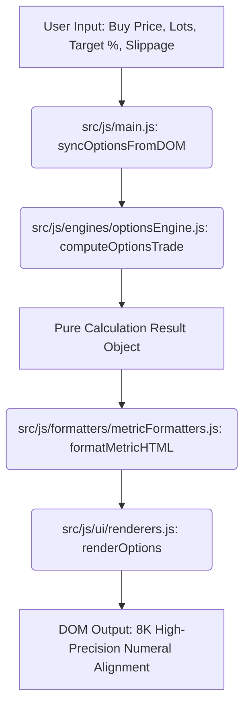

# System Architecture & Technical Specifications

## 1. Overview
The **Upstox Options & Compounding Suite** is a quantitative financial calculator engineered to solve two critical problems for options traders on Indian exchanges (NSE & BSE):
1. **Analytical Target Sell Price Solver:** Accurately calculating the exact exit price required to guarantee a target net ROI after accounting for all statutory taxes (STT, GST, Stamp Duty, SEBI, Exchange fees), Upstox ₹30/order brokerage, bid-ask slippage, next-trade re-entry funding, and exchange ₹0.05 tick size constraints.
2. **Discrete Compounding Velocity Engine:** Determining the exact natural number of trades and daily pacing required to compound capital from initial to target goals.

---

## 2. Directory Hierarchy (Industrial Clean Architecture)

```
upstox-calculator/
├── .github/
│   └── workflows/
│       └── ci.yml                     # Continuous integration workflow
├── docs/
│   ├── ARCHITECTURE.md               # Technical architecture & design
│   └── TARIFF_REGULATORY_2026.md     # Upstox & SEBI statutory breakdown
├── scripts/
│   ├── options_brokerage_calculator.py  # Python standalone CLI calculator
│   └── upstox_live_charges_verifier.py  # Live Upstox API charge verifier
├── src/
│   ├── css/
│   │   ├── tokens.css                # 8K Design tokens, solar porcelain palette
│   │   ├── base.css                  # Canvas resets, body background, typography
│   │   ├── layout.css                # 2-column grid, responsive media queries
│   │   ├── components/
│   │   │   ├── header.css            # Logo, tab pills, radar pulse dot
│   │   │   ├── forms.css             # Inputs, chips, iOS tactile switch
│   │   │   ├── cards.css             # Metric cards, hero card, 8K numeral alignment
│   │   │   ├── sensitivity.css       # Capital carryover & matrix cards
│   │   │   └── modal.css             # 2026 Tariff rules dialog
│   │   └── main.css                  # Master CSS bundle
│   └── js/
│       ├── config/
│       │   └── constants.js          # Upstox tariff rates, indices, defaults
│       ├── engines/
│       │   ├── optionsEngine.js      # Pure analytical solver for options target
│       │   └── compoundingEngine.js  # Pure discrete solver for compounding velocity
│       ├── formatters/
│       │   └── metricFormatters.js   # 8K Numeral micro-alignment & currency
│       ├── ui/
│       │   ├── domElements.js        # Cached DOM element selectors
│       │   └── renderers.js          # Dashboard renderers & modal handlers
│       └── main.js                   # Application coordinator & event bindings
├── tests/
│   ├── test_options_calculator.py    # Unit tests for tax/brokerage accuracy
│   └── test_compounding_velocity.py  # Unit tests for natural trade ceiling
├── .editorconfig                     # Consistent cross-editor formatting
├── .gitignore                        # Git ignore patterns
├── index.html                        # Semantic HTML5 entry point
├── package.json                      # NPM scripts and project metadata
└── README.md                         # Comprehensive documentation
```

---

## 3. Data Flow & Execution Pipeline



---

## 4. Key Mathematical Invariants

1. **Exchange Tick Size Quantization:**
   NSE and BSE equity derivative contracts strictly trade in ₹0.05 increments. All calculated limit sell prices and breakevens ceiling up to the nearest valid multiple of 0.05:
   $$\text{Price}_{\text{NSE}} = \frac{\lceil P_{\text{exact}} \times 20 \rceil}{20}$$

2. **Natural Number Discrete Pacing:**
   Traders can only execute natural whole trades (e.g. 1 trade, 2 trades). Fraction-of-a-trade averages (such as 1.16 trades/day) or ambiguous ranges (1–2 trades/day) are eliminated by computing:
   $$\text{Daily Trades} = \max\left(1, \left\lceil \frac{\text{Total Trades}}{\text{Available Days}} \right\rceil\right)$$
   $$\text{Days Needed} = \left\lceil \frac{\text{Total Trades}}{\text{Daily Trades}} \right\rceil \le \text{Available Days}$$
